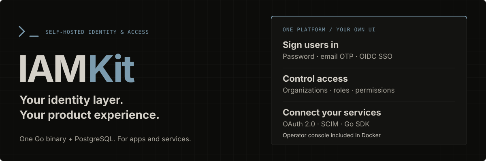

<div align="center">



# IAMKit

**Identity and access management with clear authority boundaries.**

A self-hosted Go service for isolated projects and environments, resource-scoped permissions,
and application identity—without treating end users as system administrators.

<p>
  <a href="go.mod"></a>
  <a href="docs/api.md"></a>
  <a href="SECURITY.md"></a>
  <a href="#provenance--license"></a>
</p>

**[Get started](#get-started)** &nbsp; · &nbsp;
**[Authority model](#your-authority-model-is-the-product)** &nbsp; · &nbsp;
**[Capabilities](#capabilities)** &nbsp; · &nbsp;
**[Validation](#validation)** &nbsp; · &nbsp;
**[Go deeper](#go-deeper)**

</div>

---

## Your authority model is the product

**Identity systems fail at their boundaries.** IAMKit makes those boundaries explicit: operators manage the workspace; projects contain isolated environments; organizations and memberships model business access; resources define the APIs and permissions an application can use.

No magic `iam` application. No wildcard administrative permission. No inferred authority from a job title, reporting line or matching email address.

<table>
<tr>
<td width="50%" valign="top">
<h3>01 · Separate administration</h3>
<p>Opaque management credentials belong to workspace operators only. End-user, OAuth, SCIM and machine credentials never administer IAMKit.</p>
</td>
<td width="50%" valign="top">
<h3>02 · Isolate the environment</h3>
<p>Users, memberships, clients, resources and sessions are bound to an environment. Development, staging and production do not share identity state.</p>
</td>
</tr>
<tr>
<td width="50%" valign="top">
<h3>03 · Make permission local</h3>
<p>Each API resource owns an audience and an exact permission catalog. Roles and direct grants can only use permissions declared by that resource.</p>
</td>
<td width="50%" valign="top">
<h3>04 · Bind every token</h3>
<p>Application and machine tokens are restricted to their environment, application, resource and audience. Consumers validate those boundaries before authorizing a request.</p>
</td>
</tr>
</table>

**Operators manage the system. Organizations manage business membership. Resources authorize API access.**

> [!IMPORTANT]
> **Early development.** Not a certified or independently audited authentication product. Public signup/invitations, passkeys/MFA, a hosted dashboard, distributed abuse controls, full audit coverage and production key rotation are not implemented. Read [security status](SECURITY.md) before any non-local deployment.

## Model

```text
Workspace — operators and opaque management credentials
└── Project
    └── Environment — isolated development / staging / production
        ├── Users → organization memberships
        ├── Organizations → org units, reporting managers, positions
        ├── Applications → OAuth clients and client/resource bindings
        ├── Resources → API audiences, permission catalogs, roles and grants
        ├── Service accounts → resource-bound machine credentials
        └── Federation and SCIM provisioning connections
```

No special `iam` application exists. End-user, machine, OAuth and SCIM credentials cannot administer IAMKit. Organization membership, reporting hierarchy and job titles never imply workspace operator authority. Operators are workspace-wide owner/admin/viewer; project-specific operator delegation is not implemented.

## Capabilities

| Area | What it does |
| :--- | :--- |
| **Operators** | Local first-owner bootstrap/recovery, operator delegation, expiring management-key rotation/revocation |
| **Directory** | Users, organizations, memberships, client/resource registration, catalogs, roles and direct grants |
| **Org structure** | Configurable org units, ancestry/descendants/tree, reporting-manager cycle checks, positions and assignments |
| **Login** | Password login, opt-in email OTP login, email verification and password reset; trusted email-delivery webhook |
| **Tokens** | Fifteen-minute RSA access tokens, JWKS, online introspection, logout, 24-hour session/refresh families, rotation and replay revocation |
| **Impersonation** | Owner-only, with reason, actor attribution, short expiry, no refresh and audit record |
| **Federation** | External OIDC federation, single-use browser-bound state, nonce/PKCE, explicit account links and deployment-approved credential bindings |
| **OAuth/OIDC** | Headless authorization-code server: public/confidential clients, S256 PKCE, discovery, refresh rotation and revocation. An application supplies its own login/consent UI |
| **SCIM** | User provisioning, filtering/pagination, discovery schemas, enterprise manager, deactivation and connection-stable credential rotation |
| **SDK** | Go management, identity, OAuth and SCIM clients, offline/online validation and Fiber middleware |
| **Migrations** | Embedded, checksummed, ordered database migrations. No automatic legacy data adoption |

## From bootstrap to protected API

| Start with | Then establish |
| :--- | :--- |
| **A workspace owner** | Bootstrap a local owner and save the one-time management credential in a new `0600` file |
| **An isolated environment** | Create a project and development/staging/production environment; identities do not cross the boundary |
| **An application and resource** | Register your app, define the API audience and permission catalog, then explicitly bind them |
| **Business access** | Add memberships and issue direct grants or role assignments for the API resource |
| **A protected consumer** | Validate a token's trusted issuer/audience/environment/application/resource boundaries, then require an exact permission |

See the [functional mapping](docs/functional-migration.md) for intentional breaking changes from any prior implementation. Email OTP is a login method, **not** password-plus-second-factor MFA.

## Get started

### 1. Requirements

- Go 1.26.6+
- Docker Compose
- OpenSSL

### 2. Local setup

```sh
cp .env.example .env
mkdir -p .dev-secrets
openssl genrsa -out .dev-secrets/jwt.pem 2048
chmod 600 .dev-secrets/jwt.pem
docker compose up -d --wait
set -a
. ./.env
set +a
go run ./cmd/iamkit migrate
go run ./cmd/iamkit bootstrap --email owner@example.com --workspace Demo --output .dev-secrets/owner.json
go run ./cmd/iamkit
```

> [!NOTE]
> Only process environment is loaded. Compose uses the `identity_data` volume; it neither upgrades nor deletes old database volumes — **use a fresh database**. The migration runner refuses unmanaged non-empty schemas and verifies applied migration checksums. Never edit applied migrations; add another numbered file. Compose does not apply SQL automatically.

### 3. Rotate or recover management credentials

Management keys expire after 24 hours.

```sh
# Rotate: POST /management/v1/keys, then revoke the old key separately.

# Trusted local recovery replaces all credentials for an existing active
# workspace owner, without promoting another user:
go run ./cmd/iamkit recover-owner --email owner@example.com --workspace WORKSPACE_UUID --output .dev-secrets/recovered.json
```

Bootstrap/recovery use exclusively created `0600` files. Never embed management, service, SCIM or confidential OAuth/provider secrets in browser code.

### 4. Provision a product

Once a management credential exists, follow the [API guide](docs/api.md) to create a project/environment and then users, organizations, applications, resources, grants/roles and service accounts. Short version:

```sh
GET  /management/v1/me                                            # workspace/operator IDs
POST /management/v1/projects                                      # {"name":"InvoiceCloud"}
POST /management/v1/projects/{project}/environments                # {"name":"production"}
POST /management/v1/environments/{environment}/resources           # {"name":"Billing API","audience":"https://billing.example","permissions":["invoices:read"]}
PUT  /management/v1/environments/{environment}/grants               # {"organization_id":"ORG","user_id":"USER","resource_id":"RESOURCE","permissions":["invoices:read"]}
```

An organization owner still needs a resource grant to use that resource; membership alone does not issue a token.

### 5. OAuth/federation deployments

For OAuth/federation, use a stable HTTPS issuer, configure `OIDC_HMAC_SECRET` (at least 32 random bytes), and serve the interaction UI over HTTPS: browser-binding cookies use `Secure` and `__Host-` restrictions. Password/machine login and health checks can be exercised over HTTP locally. Optional webhook/federation configuration is described in [`.env.example`](.env.example) and the [API guide](docs/api.md).

## Validation

```sh
make build
make test              # root and nested SDK
make vet               # root and nested SDK
make test-e2e          # disposable PostgreSQL 16; Docker required
make test-all
```

Plain `go test ./...` skips database tests unless `IAMKIT_TEST_E2E=1`. Enabled infrastructure failures fail the suite. Tests never use the development database. The SDK is a separate module and is explicitly checked by the Makefile.

## Layout

```text
cmd/iamkit/           Server, migration, bootstrap and recovery commands
internal/bootstrap/   Composition root: concrete adapters and configuration
internal/identity/    Shared domain boundaries and validation
internal/iam/         Domain modules, use cases and named adapters (see below)
internal/server/      HTTP route composition and shared error handling
migrations/           Embedded checksummed migrations
sdk/                  iamclient, authclient, authclient/fiberauth, scimclient
tests/e2e/            Disposable-database security/functional journeys
```

<details>
<summary><strong>Module structure · how each IAM domain is organized</strong></summary>

Each IAM module owns its domain types and ports, its specifically named use-case package, and its infrastructure adapters:

```text
internal/iam/user/
  user.go, ports.go       Domain and repository/password ports
  usersvc/                Use cases and validation
  adapters/userpg/        PostgreSQL implementation
  adapters/userhttp/      Fiber request/response mapping
```

The same structure applies to:

| Module | Packages |
| :--- | :--- |
| `organization` | `orgsvc`, `orgpg`, `orghttp` |
| `oauth` | `oauthsvc`, `oauthpg`, `oauthhttp`, `oauthfosite` |
| `authentication` | `authsvc`, `authpg`, `authhttp`, `authbcrypt`, `authjwt`, `authmail`, `authsecret` |
| `authorization` | `authz*` |
| `management` | `mgmt*` |
| `federation` | `fed*` |
| `provisioning` | `prov*` |
| `application` | `app*` |
| `serviceaccount` | `sacct*` |
| `impersonation` | `imp*` |

`adapters/` only groups packages; it is not itself a Go package. Domain and service packages do not import Fiber, SQL drivers, Fosite, bcrypt or concrete adapters. Backend failures use `internal/errx`; the independently consumable SDK uses `sdk/apierror`.

Modules: `github.com/Abraxas-365/iamkit` and `github.com/Abraxas-365/iamkit/sdk`. Existing SDK/API contracts intentionally break between releases. Offline JWT validation cannot observe revocation before expiry; use online introspection for immediate authorization changes.

</details>

## Go deeper

| If you're here to… | Start here |
| :--- | :--- |
| Walk through every management/identity/OAuth endpoint | [API guide](docs/api.md) |
| Understand what changed from a prior implementation | [Migration notes](docs/migration.md) · [Functional mapping](docs/functional-migration.md) |
| Check enforced security boundaries and deployment requirements | [Security status](SECURITY.md) |
| Wire permission checks into your own Fiber app | `sdk/authclient/fiberauth` — `Authenticate`, `RequirePermissions`, `RequireOrganization` |

## Provenance / license

This project adapts local `paframework`, which identified `github.com/Practical-Action-Global/iam`. No upstream root license was found. No distribution license is asserted: confirm ownership/permission and dependency licensing before publishing. Source secrets, deployment infrastructure and Git history were not copied.
