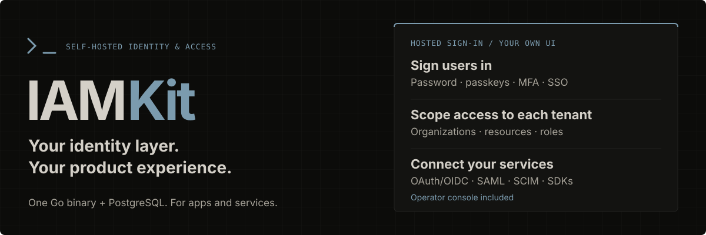
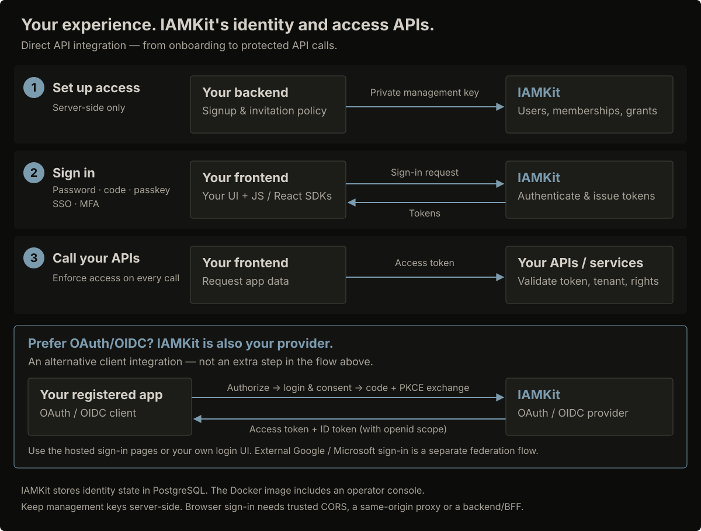

<div align="center">

<picture>
  <source media="(prefers-color-scheme: light)" srcset="docs/assets/iamkit-logo-light.svg" />
  
</picture>



# IAMKit

**Self-hosted identity and resource-scoped access control for your application's backend.**

Run IAMKit alongside your app. Users sign in through hosted pages, your own UI
or a standard OAuth/OIDC client. Your backend manages business access, and you
own the product experience.

**[Run with Docker](#get-started)** · **[Integrate your app](#integrate-your-application)** ·
**[IAMKit vs Ory and Keycloak](#iamkit-vs-ory-and-keycloak)** · **[Documentation](docs/index.md)**

</div>

> [!NOTE]
> **Integration responsibilities:** you decide who may join (self-service sign-up
> is off by default) and which access new users get. The deployment supplies
> TLS, backups and secret storage. See
> [publication requirements](#provenance--license).

## How it fits into your application



**IAMKit can also be your OAuth/OIDC provider.** Register your apps as clients
and use authorization code + PKCE to obtain access tokens and OIDC ID tokens.
Turn on [hosted sign-in pages](docs/guides/applications/hosted-login.md) per client, or
build your own with the [custom sign-in SDKs](docs/guides/applications/custom-sign-in-ui.md).
This is different from **external federation**, where IAMKit lets users sign in
through Google, Microsoft, a SAML or LDAP directory or another provider.
See [OAuth/OIDC client integration](docs/guides/applications/oauth-oidc.md) and
[external federation](docs/guides/enterprise/federation.md).

IAMKit separates **administration** from **authentication**:

- **Your app backend** owns signup eligibility, tenant selection and default
  access. It calls `/management/v1` using a private `ik_mgmt_…` key to create
  users, invite them, add memberships and assign permissions.
- **Your users sign in** through `/identity/v1` (password, email code, passkey,
  social/enterprise SSO, with optional MFA), through the hosted pages
  or through `@iamkit/js` / `@iamkit/react` in your own UI. These requests do
  not need a management key. They can also go through your backend/BFF.
- **Your protected API** validates the access token's signature, issuer, audience
  and environment/application/resource boundaries, then checks permissions and
  matches the token's organization to the requested tenant. A successful login
  is not permission to call every API or access another tenant's data.
- **IAMKit** stores identities, memberships, grants and sessions in PostgreSQL.
  The Docker image includes a built-in **operator management console** (React SPA)
  served at the root URL — no separate frontend deployment needed. The console
  source lives in [`frontend/`](frontend/README.md). An opt-in
  [organization admin portal](docs/guides/organizations/organization-administration.md)
  lets your customers manage their own members.

**A service account is not a workspace operator credential.** It exchanges its
secret for a machine JWT. With explicit built-in IAM resource permissions, that
JWT can administer selected entities of its own environment through the
[scoped IAM API](docs/reference/api/scoped-iam.md).
It cannot replace workspace/federation/OAuth administration through `/management/v1`.
Management keys belong to workspace operators and carry workspace-wide authority.
Never expose either secret in browser code or build an unrestricted public proxy.

For browser calls, use a same-origin reverse proxy, register the sign-in app's
origins on its OAuth client, or configure the trusted `CORS_ALLOWED_ORIGINS`
allowlist. Keep management routes out of public signup proxies. Use HTTPS for
non-local deployments.

## IAMKit vs Ory and Keycloak

A comparison of approach, not a performance benchmark or feature-parity claim.

| | **IAMKit** | **Ory** | **Keycloak** |
| :--- | :--- | :--- | :--- |
| **What is it?** | Single Go binary with built-in operator console. Users, orgs, permissions, MFA and passkeys, federation, OAuth 2.0/OIDC, SAML, SCIM, events and webhooks — all included. | Toolkit — pick Kratos (users), Hydra (OAuth), Keto (permissions) and wire them together. | Full platform — SSO server with built-in admin console, login pages, and account management. |
| **SSO and federation** | OIDC and OAuth 2.0 federation (Google, Microsoft, GitHub, Apple, GitLab, any OIDC provider), SAML 2.0 and LDAP/AD for organizations. OAuth 2.0/OIDC server with PKCE, device flow and token exchange; SAML 2.0 identity provider for applications (SP-initiated). | Hydra provides OAuth/OIDC. Federation and SAML require additional integration. | OIDC, SAML 2.0, LDAP/AD, Kerberos — broadest protocol support out of the box. |
| **Who builds the UI?** | Your choice: brandable hosted sign-in pages (23 languages), your own UI with the JS/React SDKs, or fully headless APIs. | You do, but each component has its own integration surface. | Keycloak provides hosted login/registration pages you configure and theme. |
| **How does access control work?** | Resources have permission catalogs. You assign permissions to users via roles or direct grants, scoped to an organization. | Add Keto for relationship-based authorization, or roll your own. | Roles and policy-based authorization built into the platform. |
| **Best for** | A shared identity layer for B2B apps and multi-service systems, with tenant-aware access and control over the sign-in experience. | Teams that want to pick and compose identity building blocks for a custom architecture. | Teams that want a battle-tested platform with broad enterprise protocol support (SAML, LDAP/AD) and minimal custom UI work. |
| **Main trade-off** | Younger project. No Kerberos, SAML single logout or IdP-initiated SAML yet. | You pick the pieces and own the glue — more architectural decisions upfront. | You work within Keycloak's realm/client/flow model — flexibility comes through configuration, not code. |

All three support SSO via OIDC. Choose based on your requirements: if you need
Kerberos or SAML single logout today, evaluate Keycloak. If you want fully
modular, independent components, evaluate Ory. If you want one binary that
covers identity, access control and multi-tenant boundaries — whether for a
single product or as a shared identity layer across services — IAMKit is built
for that.

Official references: [Ory](https://www.ory.com/docs/oss/getting-started),
[Keycloak](https://www.keycloak.org/).

## Get started

### 1. Build and configure the Docker stack

Requirements: Docker with Compose, OpenSSL and a checkout of this repository.
**No host Go installation is needed.** Use the source-build Compose file until
you have a verified published image. For a public host, use the
[TLS Compose deployments or the Helm chart](#deploy) instead.

Create a private `.env.docker` file with the following values, replacing every
placeholder (do not commit it):

```dotenv
POSTGRES_PASSWORD=REPLACE_WITH_RANDOM_HEX
OIDC_HMAC_SECRET=REPLACE_WITH_AT_LEAST_32_RANDOM_BYTES
IAMKIT_ENCRYPTION_KEY=REPLACE_WITH_BASE64_OF_32_RANDOM_BYTES
JWT_ISSUER=http://localhost:8080
IAMKIT_PORT=8080
IAMKIT_BOOTSTRAP_EMAIL=owner@example.com
IAMKIT_BOOTSTRAP_WORKSPACE=Demo
IAMKIT_BOOTSTRAP_PASSWORD=REPLACE_WITH_UNIQUE_12_TO_72_BYTE_PASSWORD
```

Generate secrets with `openssl rand -hex 32` and the encryption key with
`openssl rand -base64 32`. A hex database password avoids special-character
escaping in the connection URL. The Compose template requires
`OIDC_HMAC_SECRET` even if you only intend to try password login. The
encryption key seals stored secrets (TOTP seeds, SSO client secrets, SMTP
passwords, webhook secrets, signing keys); features that store one refuse
without it. Back it up: losing it makes those secrets unreadable.

```sh
chmod 600 .env.docker
mkdir -p secrets
chmod 700 secrets
openssl genrsa -out secrets/jwt.pem 4096
chmod 600 secrets/jwt.pem

docker compose --env-file .env.docker -f docker-compose.production.yml build
```

The image runs as a non-root `iamkit` user. On Linux bind mounts, ensure that user
can read the key; do **not** make the private key world-readable. For a local
Docker host with ordinary UID mapping, obtain the image's IDs and set ownership:

```sh
CONTAINER_OWNER=$(docker compose --env-file .env.docker -f docker-compose.production.yml \
  run --rm --no-deps --entrypoint sh iamkit \
  -c 'printf "%s:%s" "$(id -u)" "$(id -g)"')
sudo chown "$CONTAINER_OWNER" secrets/jwt.pem
```

Rootless Docker, user-namespace remapping and managed container platforms may
require different ownership/secret-mount configuration. Keep the mount read-only
and grant access only to the runtime identity.

### 2. Start IAMKit

```sh
docker compose --env-file .env.docker -f docker-compose.production.yml up -d --wait
curl --fail http://localhost:8080/health
```

The expected health response is `{"status":"healthy","service":"iamkit"}`.
PostgreSQL data persists in a named volume. Do not remove that volume to upgrade.

On startup IAMKit runs embedded migrations. With bootstrap variables set and no
workspace yet, it creates the owner/workspace and sets the operator password.
Existing workspaces skip bootstrap; changing bootstrap variables is **not** a
password-reset mechanism. Start with an empty database: unmanaged non-empty
schemas and modified migration checksums are rejected.

> [!WARNING]
> **Automatic bootstrap currently prints the initial management key to logs.**
> View it only in a trusted terminal, move it into secret storage, and rotate/revoke
> it after setup. Restrict container log access and retention. The initial key
> expires after 24 hours. Remove bootstrap values after initialization.
> For deployments that must not log credentials, omit bootstrap variables and use
> the explicit `iamkit bootstrap … --output /secure/path/owner.json` CLI flow with
> a writable, restricted output mount. Follow the [explicit-bootstrap quickstart](docs/start/docker-quickstart.md)
> and [deployment runbook](docs/operations/deployment.md).

```sh
docker compose --env-file .env.docker -f docker-compose.production.yml logs iamkit
```

The sample publishes port 8080 on the host. Restrict it to loopback or a private
network as appropriate, and put TLS in front before exposing it. HTTP localhost
is for testing password/machine login and health checks; OAuth, federation,
passkeys and operator-console cookies require HTTPS. The Compose filename does
not imply production hardening.

### 3. Configure optional services

Configuration is read from **process environment**. Compose's `--env-file` supplies
interpolation values; it does not automatically inject every variable into the
container. Add optional settings to the `iamkit.environment` map (or a Compose
override) as well as your private environment file. The
[configuration reference](docs/reference/configuration.md) lists every variable.

| Container variable | Purpose |
| :--- | :--- |
| `DATABASE_URL` | PostgreSQL connection string; supplied by the example Compose stack |
| `JWT_PRIVATE_KEY_PATH` | Mounted RSA private key; `/secrets/jwt.pem` in the example. Per-environment [signing keys](docs/guides/applications/signing-keys.md) can replace it |
| `JWT_ISSUER` | Stable public issuer URL; HTTPS outside loopback development |
| `SERVER_PORT` | API port inside the container; keep 8080 to match the example healthcheck |
| `OIDC_HMAC_SECRET` | Stable OAuth secret, at least 32 random bytes |
| `IAMKIT_ENCRYPTION_KEY`, `IAMKIT_ENCRYPTION_KEYS_OLD` | Seals stored secrets; old keys decrypt only, for rotation |
| `EMAIL_PROVIDER` and `EMAIL_*`/`SMTP_*`/`RESEND_API_KEY` | Default mail delivery: a webhook (`EMAIL_WEBHOOK_URL`, `EMAIL_WEBHOOK_TOKEN`), SMTP or Resend (can be overridden per environment from the console) |
| `IAMKIT_TRUSTED_PROXIES` | Reverse proxies whose `X-Forwarded-*` headers name the client |
| `REDIS_URL` | Optional; replicas share rate limits, usage windows and a small cache |
| `OTEL_EXPORTER_OTLP_ENDPOINT`, `IAMKIT_METRICS_ADDR` | Traces/metrics over OTLP, Prometheus listener ([observability](docs/operations/observability.md)) |
| `IAMKIT_OPERATOR_SSO_PROVIDERS` | Console single sign-on for operators ([operator SSO](docs/reference/configuration.md#operator-single-sign-on)) |
| `IAMKIT_FEATURES`, `IAMKIT_LIMITS` | Deployment [feature flags](docs/guides/platform/feature-flags.md) and [usage limit](docs/guides/platform/usage-limits.md) ceilings |

Email codes, email verification, password reset, sign-up and invitations need
email delivery. With a **webhook**, IAMKit sends `{email, purpose, code}` and
**your service sends the email**; with **SMTP** or **Resend**, IAMKit writes the
email in your branding and language (wording customizable per email) and sends
it. The global configuration applies to all environments by default; you can
override it per environment from the operator console (**Notifications** tab)
or the management API (`PUT /environments/:id/delivery`). Per-environment config
takes priority. SMS factor codes and phone verification use a per-environment
Twilio or webhook provider. Do
not log codes or webhook payloads. See
[email delivery](docs/guides/platform/email-delivery.md).

Federation connections store their client secret sealed with the encryption
key (or reference an approved `FEDERATION_CREDENTIAL_BINDINGS` entry, see
[`.env.example`](.env.example)). Organization connections can provision users
on first sign-in (JIT) or link an existing member by verified email. See
[federation](docs/guides/enterprise/federation.md) and
[social login](docs/guides/enterprise/social-login.md).

## Integrate your application

### Example: InvoiceCloud signup and password login

**One-time setup:** create a project/environment, an organization (`Acme`), an
application (`Web App`) and a resource (`Invoices API`). Define the resource's
permission catalog and bind the application to it. Use the management console,
the [`iam` CLI](#development-and-documentation) or the management API as
illustrated below.

For example, under `/management/v1/environments/ENV_UUID`, authenticated with your
backend's management key:

```http
POST /applications
{"name":"Web App","redirect_uris":["https://app.example.com/callback"]}

POST /resources
{"name":"Invoices API","prefix":"invoices","audience":"https://api.example.com","permissions":["invoices:read"]}

POST /application-resources
{"application_id":"APP_UUID","resource_id":"RESOURCE_UUID"}
```

These are relative routes and illustrative JSON bodies; replace UUID placeholders
with IDs returned by creation calls. All JSON requests need `Content-Type:
application/json`.

**Signup:** Alice submits your signup form to **your backend**. Your backend
checks eligibility and selects the organization/default permissions
server-side, then makes these management calls under the same environment
prefix:

```http
POST /users
{"name":"Alice","email":"alice@example.com","password":"example-password-replace-me"}

POST /memberships
{"organization_id":"ORG_UUID","user_id":"USER_UUID"}

PUT /grants
{"organization_id":"ORG_UUID","user_id":"USER_UUID","resource_id":"RESOURCE_UUID","permissions":["invoices:read"]}
```

Each request carries `X-API-Key: ik_mgmt_…` **from your backend only**.
Membership and an appropriate resource grant are prerequisites for this login,
not optional onboarding decorations. These are separate requests, not one atomic
signup transaction: handle partial failures/retries in your onboarding workflow.
Do not trust a public form to select privileged roles, arbitrary orgs or grants.
Add abuse prevention and email-ownership verification appropriate to your product.

If anyone may join, turn on [self-service sign-up](docs/guides/sign-in/signup-and-onboarding.md#self-service-sign-up)
instead: `POST /identity/v1/signup` confirms the email with a code and places
every new account in one chosen organization (and optional group). To bring
people into an existing organization, send [invitations](docs/reference/api/identity.md#invitations).

**Sign in:** your frontend (or BFF) sends Alice's credentials and the intended
boundary to IAMKit. No management key is needed:

```js
const response = await fetch('/identity/v1/login', {
  method: 'POST',
  headers: { 'Content-Type': 'application/json' },
  body: JSON.stringify({
    environment_id: 'ENV_UUID',
    organization_id: 'ORG_UUID',
    application_id: 'APP_UUID',
    resource_id: 'RESOURCE_UUID',
    email: 'alice@example.com',
    password: passwordFromForm,
  }),
})
if (!response.ok) throw new Error('Sign-in failed')
const { access_token, refresh_token } = await response.json()
```

This relative URL assumes your app's reverse proxy forwards `/identity/` to
IAMKit. IDs are identifiers, not secrets; IAMKit checks the requested boundary
against actual memberships, bindings and grants. Select tenant context through a
trusted onboarding/invitation flow, not by granting whatever the browser requests.
If Alice has a second factor, the answer is a pending MFA login instead of
tokens; see [MFA](docs/guides/sign-in/mfa.md).

**Call your API:** send `Authorization: Bearer <access_token>` to the Invoices API.
The API must validate the token, require `invoices:read`, and match its
`organization_id` to the requested tenant before returning data. Scope database
queries to that organization; a permission check alone is not tenant isolation.
Use the SDK's `RequireOrganization` middleware or an equivalent application check.
Keep browser tokens in memory or use a BFF with appropriately protected cookies;
do not log tokens. Treat refresh tokens as secrets and handle rotation.

Use `/.well-known/jwks.json` / the [Go SDK](sdk/README.md) for signature and boundary
validation. Offline validation cannot see revocation before token expiry; use
online introspection when you need current session/access status.

### Other ways to sign in

| Method | App flow | Prerequisites |
| :--- | :--- | :--- |
| Password | `POST /identity/v1/login` with an email or username and the full boundary | Active user with a password, membership, app/resource binding and grant |
| Email code | `POST /identity/v1/challenges` with environment, email and `purpose: "login"`; then `/challenges/verify` with challenge ID, 8-digit code, purpose and full boundary | User has codes enabled; email delivery configured; same access prerequisites |
| Passkey | `/identity/v1/passkeys/login/begin` and `/finish` (WebAuthn) | Passkey enrolled; HTTPS origin; passkeys allowed by the sign-in policy |
| Social or enterprise SSO | `POST /identity/v1/federation/start` with connection ID and full boundary; follow provider redirect/callback. LDAP posts the password to `/federation/ldap/login` | Federation connection (OIDC, OAuth 2.0, SAML or LDAP), linked or JIT-provisioned identity and appropriate local access |
| OAuth/OIDC client flow | Register an OAuth client bound to an app/resource, then use authorization code + S256 PKCE | [Hosted pages](docs/guides/applications/hosted-login.md) or your own UI with [`@iamkit/js`/`@iamkit/react`](docs/guides/applications/custom-sign-in-ui.md); HTTPS; see the [OAuth guide](docs/guides/applications/oauth-oidc.md) |
| Machines | Service-account `client_credentials`, machine-user personal access tokens or signed JWT assertions | See [service accounts](docs/guides/machines/service-accounts.md) and [machine users](docs/guides/machines/machine-users.md) |

OAuth clients represent **apps obtaining tokens from IAMKit**; federation
connections represent **external providers authenticating users to IAMKit**.
The fixed app/resource mapping is an IAMKit design choice, not a universal OAuth
requirement. Password/federation specify that boundary at login time; email codes
specify it at verification time.

One user can have a password, email codes, passkeys and multiple linked
providers. These resolve to the same local user, but each successful login
creates its own session. A sign-in code is a login method; **multi-factor
authentication** is separate: TOTP, email or SMS codes and security keys,
required per environment or organization, with recovery codes. See
[MFA](docs/guides/sign-in/mfa.md).

Forgot password uses `/challenges` with `purpose: "password_reset"`, followed by
`/challenges/verify` with environment, challenge ID, code, purpose and the new
password. Success returns 204, not a login session. It requires an
existing password and configured email delivery. Hosted pages include this
flow; with headless APIs your app supplies the UI.

New passwords follow the environment's [password policy](docs/guides/sign-in/password-policy.md)
(default 12–72 bytes; optional composition rules and breached-password check),
which can also lock accounts after repeated wrong passwords and expire old ones.
Organizations can add stricter requirements for their members. The
[sign-in methods](docs/guides/sign-in/sign-in-methods.md) policy turns password,
password reset, email code, passkey, social sign-in or sign-up off per
environment or organization.

## Model and capabilities

```text
Workspace — operators and management credentials
└── Project
    └── Environment — isolated development / staging / production
        ├── Users (people and machine users) and organization memberships
        ├── Organizations — units, groups, positions, verified domains, own admins
        ├── Applications — resource bindings, OAuth clients, SAML service providers
        ├── Resources — audiences, permission catalogs, roles, grants, sharing with organizations
        ├── Service accounts — resource-bound machine credentials
        ├── Federation and SCIM provisioning connections
        └── Events, webhooks, actions, signing keys, branding, limits
```

There is no special `iam` application or wildcard administrative permission.
Each environment has a built-in IAM resource with explicit permissions for the
scoped management API. Organization membership and job titles never imply
workspace operator authority.

Also included:

- **Sessions and tokens:** refresh-token rotation with replay revocation, online
  introspection, opaque or JWT access tokens, back-channel logout, per-environment
  signing-key rotation.
- **Events and extensibility:** a typed [event log](docs/reference/events.md)
  with change history and export, signed [event webhooks](docs/reference/event-webhooks.md),
  and [actions](docs/guides/platform/actions.md) — synchronous hooks that can deny a
  sign-in or add token claims.
- **Users:** profile schemas and metadata, usernames, verified phone numbers,
  deactivation, "sign out everywhere", forced password change, owner-only
  audited [impersonation](docs/guides/organizations/impersonation.md).
- **B2B:** [SCIM provisioning](docs/guides/enterprise/scim-provisioning.md), per-organization
  branding, MFA and password rules, sign-in method restrictions, SSO enforcement
  and an [organization admin portal](docs/guides/organizations/organization-administration.md).
- **Operations:** [usage limits](docs/guides/platform/usage-limits.md), [feature flags](docs/guides/platform/feature-flags.md),
  OpenTelemetry tracing and Prometheus metrics, optional Redis for replicas,
  background workers and embedded checksummed migrations.
- **Clients:** a Go SDK with Fiber middleware, `@iamkit/api` (typed TypeScript
  client generated from the [OpenAPI document](docs/reference/api/openapi.md)),
  `@iamkit/js`, `@iamkit/react` and the `iam` CLI.

Read the [concept guides](docs/concepts/identity-model.md) and
[API reference](docs/reference/api/index.md).

## Deploy

| Option | What you get |
| :--- | :--- |
| [`deploy/compose/caddy`](docs/operations/deployment.md#compose-with-tls) or `traefik` | One Docker host with automatic TLS, PostgreSQL on an internal network, optional Redis and OpenTelemetry collector profiles; `setup.sh` writes the secrets |
| [Helm chart](docs/operations/deployment.md#kubernetes-helm) `deploy/helm/iamkit` | Migrations as a pre-install/pre-upgrade Job, probes, HPA, PDB and ServiceMonitor; secrets only through `secretKeyRef` |
| `docker-compose.production.yml` | The local source-build stack from [Get started](#get-started); not a hardened public deployment |

Before going live, work through the [launch checklist](docs/operations/launch-checklist.md),
[backup and restore](docs/operations/backup-and-restore.md) and
[upgrades and rollback](docs/operations/upgrades-and-rollback.md).

## Container registry and publishing

The Compose deployments and the registry-oriented example
[`docker-compose.iamkit.yml`](docker-compose.iamkit.yml) reference
`ghcr.io/abraxas-365/iamkit`. **That reference is a publishing target, not
confirmation that a public release is available.** Use the source-build
quickstart above until a release has been published and verified.

Once published, use that Compose file with the same signing-key setup. It uses
`IAMKIT_DB_PASSWORD` instead of the source-build file's `POSTGRES_PASSWORD`.
Replace `latest` with a verified version tag or immutable digest for deployments.

For maintainers:

- [`publish.yml`](.github/workflows/publish.yml) builds Linux amd64/arm64 images
  on pushes to `main`, `v*` tags and manual dispatch, authenticates with
  `GITHUB_TOKEN`, and produces branch, SHA and semantic-version tags. `main`
  is not itself a release; verify the resulting tags rather than assuming
  `latest` exists.
- [`release.yml`](.github/workflows/release.yml) runs on `v*` tags: GoReleaser
  builds the `iam` CLI binaries (installed by [`install.sh`](install.sh)) and the
  Helm chart is pushed to `oci://ghcr.io/<owner>/charts/iamkit`.

Before triggering publication:

1. Resolve [ownership/license permission](#provenance--license), audit source and
   image contents for secrets, and review dependency licenses/vulnerabilities.
2. Verify the workflow builds both requested architectures and that the image
   boots against a fresh PostgreSQL database.
3. Publish an approved release, then set/check the GHCR package's public visibility.
4. Test an anonymous pull of the release tag on a clean machine and record its
   digest before recommending it to users.

No registry push is required to use a locally built image. See
[releases](docs/contributing/releases.md).

## Development and documentation

Start at the [documentation hub](docs/index.md):
[Docker quickstart](docs/start/docker-quickstart.md),
[first application](docs/start/first-application.md),
[application integration](docs/guides/applications/application-integration.md),
[API reference](docs/reference/api/index.md) and
[operations checklist](docs/operations/launch-checklist.md).
See the [validation record](docs/contributing/validation.md) for tested examples
and remaining deployment acceptance work, and [local development](docs/contributing/local-development.md)
and [testing](docs/contributing/testing.md) for contributor setup.
The default `docker-compose.yml` is for local infrastructure; the Docker
quickstart above explicitly selects the full-stack file.

```sh
make build             # bin/iamkit (server)
make build-cli         # bin/iam (management CLI)
make test              # root and nested SDK
make vet               # root and nested SDK
make test-e2e          # disposable PostgreSQL; Docker required
make test-browser      # console, hosted pages and org-admin portal in headless Chromium
make openapi           # regenerate api/openapi.json after route changes
```

Plain `go test ./...` skips database tests unless `IAMKIT_TEST_E2E=1`. Tests must
not use development data. Current references: [Go SDK](sdk/README.md),
[management console](frontend/README.md), [CLI](docs/reference/cli.md),
[custom sign-in example](examples/nextjs-login), [configuration example](.env.example).

## Provenance / license

This project adapts local `paframework`, which identified
`github.com/Practical-Action-Global/iam`. No upstream root license was found.
No distribution license is asserted: confirm ownership/permission and dependency
licensing before publishing. Source secrets, deployment infrastructure and Git
history were not copied.
