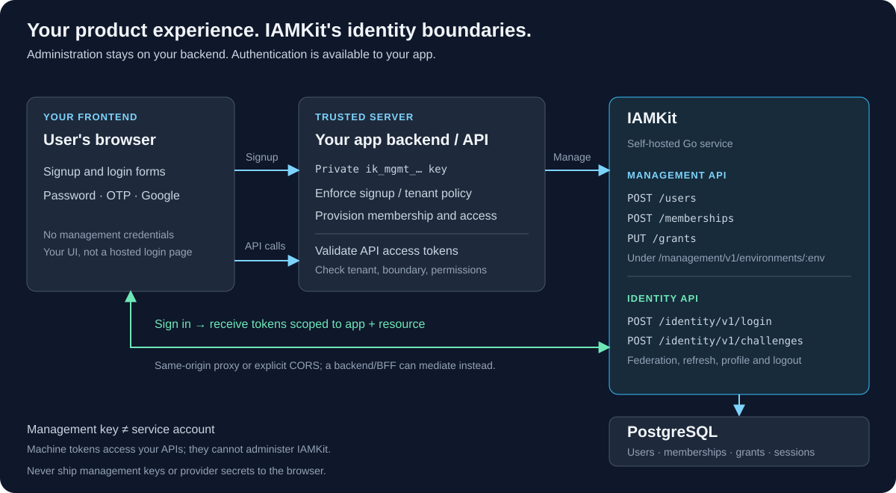

# What IAMKit does

IAMKit is a self-hosted identity and authorization backend. It stores users,
organization memberships, applications, API resources, permissions and sessions in
PostgreSQL. Your application owns the product experience and onboarding policy.

## Choose your integration

| Requirement | Use |
| --- | --- |
| Create users and assign business access | Your backend → management API, using `X-API-Key: ik_mgmt_…` |
| Sign users in with a password or email code | Your login UI → identity API (or through your BFF) |
| Sign users in with Google/Microsoft | An approved OIDC federation connection and explicit local user link |
| Let an OAuth client obtain IAMKit tokens | IAMKit's OAuth server; your login/consent interaction |
| Authenticate a worker to your business API | Service account and machine token |
| Synchronize an organization's directory | SCIM provisioning connection |

A management key is **not** a service-account token. Management credentials act
with a workspace operator's authority and must never reach a browser. Selected
IAM operations are also available through the [permission-scoped IAM API](../reference/api/scoped-iam.md):
a service account with IAM permissions can manage users/memberships there, but
cannot use the workspace management API. **Current scoped-route environment and
permission enforcement has blockers:** keep that surface restricted until the
[documented routing issues](../reference/api/scoped-iam.md#deployment-blockers)
are fixed and tested; do not use it as an isolation boundary.

## What you operate

- IAMKit backend container and PostgreSQL, with backups and secret storage.
- TLS/reverse proxy and rate limiting appropriate to your deployment.
- Built-in React management console (embedded in the Docker image).
- Optional HTTPS email delivery service and external provider registrations.
- Your frontend, signup backend and protected APIs.

The backend image serves the operator management console at the root URL.
It does not provide hosted end-user login pages — your application supplies
the signup and login UI. There is no public self-registration endpoint: use
your backend to enforce signup policy before making privileged provisioning
calls. Memberships, application bindings and grants are necessary for scoped
login, not just user creation.

## First success

Follow [Docker quickstart](docker-quickstart.md), then
[first application](first-application.md). Use a disposable installation for the
tutorial. Move to [deployment](../operations/deployment.md) before exposing it.

For platform selection, see the [README comparison](../../README.md#iamkit-vs-ory-and-keycloak).
